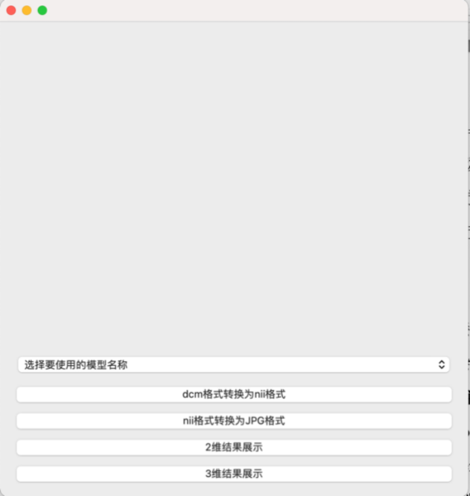
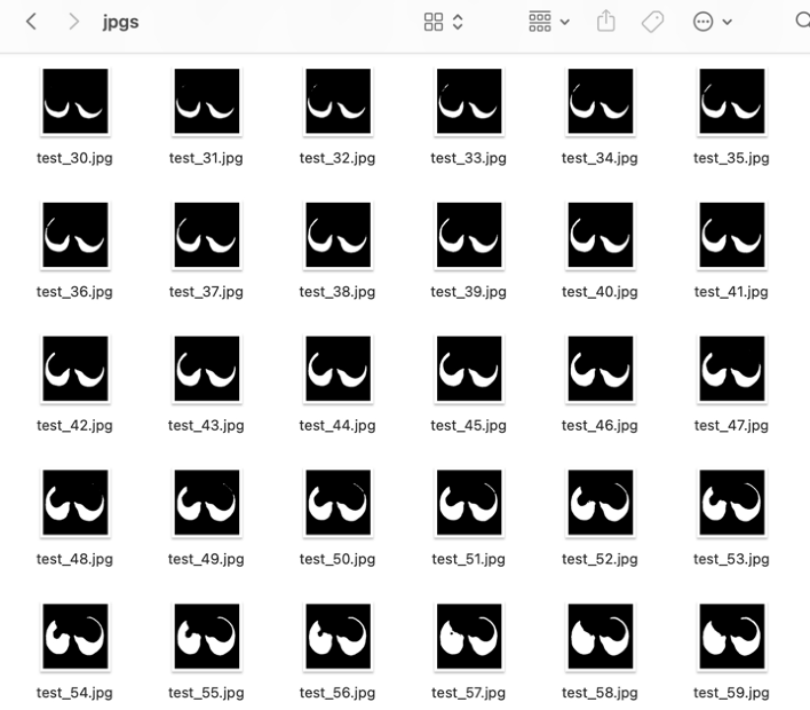
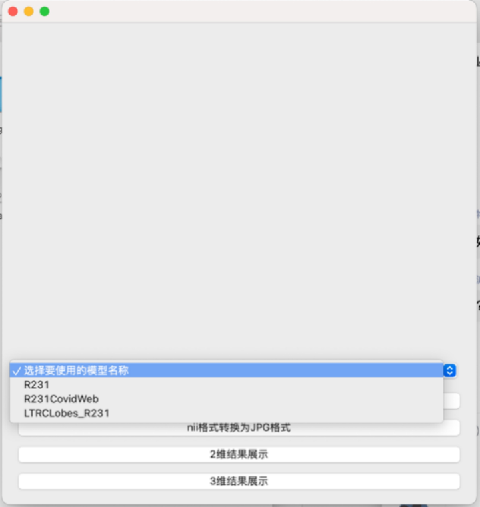
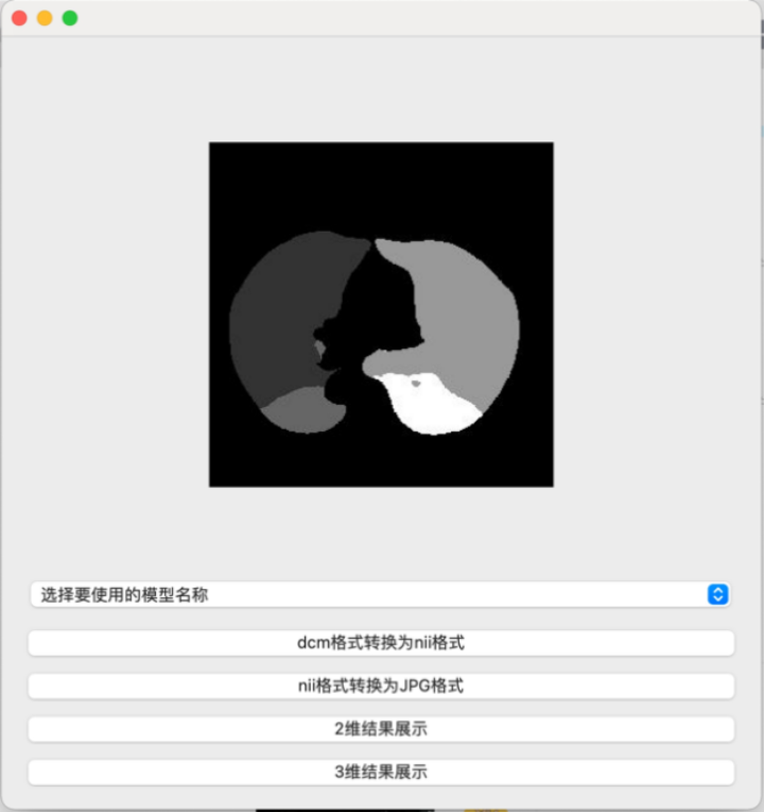
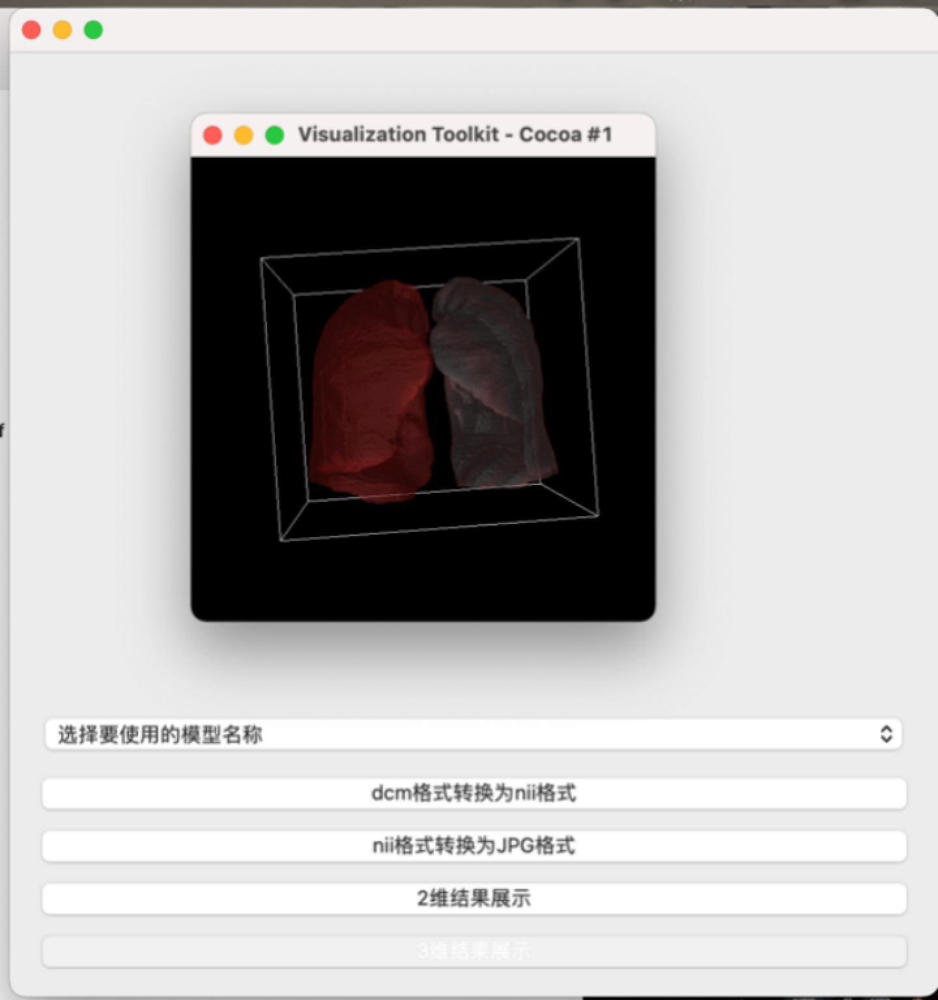

## <center>肺叶分割平台的设计及使用

5.1 设计目标与需求分析

​	医学影像格式与传统图像格式在成像原理、保存格式、读取方式上均有所不同，医生通常需要借助专业的平台软件进行阅片操作，但是该类平台软件软件并没有很好地集成后端图像处理功能，前后端分离且具有一定的滞后性。为了避免理论学术与临床医疗分离的现象，本文设计并开发了具有肺部分叶分段功能的医学影像处理平台。

根据第四章传统分割方法与U-Net实现的深度学习方法对比，深度学习方法准确度、鲁棒性都更好，同时还可以处理肺部患有疾病的情况下的肺部分叶分段功能。所以在此选择将三种U-Net模型的分割方法集成到一个肺叶分割服务平台，旨在为医生提供更加前沿的肺叶分割方法实现。系统功能主要分为文件操作功能、肺叶分割处理功能、结果展示功能。

​	5.1.1 文件操作功能

​	文件操作功能主要向用户提供读取图像和格式转换的功能，具体为：

（1）打开文件：读取待分割的CT图像；

（2）格式转换1:为了方便分割工作进行和保存结果，提供mha、dcm、nii等常见医学图像格式之间的转换功能；

（3）格式转换2:常见医学图像nii格式向传统图像jpg格式转换的功能。

​	5.1.2 肺叶分割功能

​	肺叶分割功能主要向用户提供模型选择功能，分割网络主要根据第四章所介绍的三种U-Net网络实现，用户可以选择不同的模型进行肺叶二分割或肺叶五分割，同时保存分割结果方便进行展示。

​	5.1.3 结果展示功能

​	结果展示功能主要向用户提供二维或三维的结果展示，具体功能需求为：

（1）查看每个切片的分割结果，即以jpg格式在二维空间下查看分割结果，此功能需要先讲三维CT图像转换为jpg格式保存在目录下；

（2）三维重建后立体查看整个肺部结构，支持交互操作。

 

 

图5-1 平台设计布局

Figure 5-1 Platform Design Layout

 

5.2 平台功能实现

5.2.1 开发环境

​	此平台主要基于Python中的vtk、SimpleITK、nibabel等医学图像或普通图像处理工具库，以及Pyotrch深度学习框架。使用面向对象的编程语言Python，开发平台选用PyCharm CE进行代码编写，前端可视化交互界面选择PyQt-5.15.4版本，可以方便的部署到Windows、macOS或者Linux系统上使用。

5.2.2 文件操作

​	在本文提供的肺部分叶分段功能下，需要将CT图像以nii格式传入训练好的模型，故在此模块下，提供带分割图像文件夹的选择和格式转换功能，包括dcm向nii格式的转换、nii格式向jpg格式的转换。

​	dcm格式向nii格式的转换通过dcm2nii()函数调用SimpleITK中的ImageSeriesReader功能实现，该函数按序读取目录下的dcm格式文件将其组合成连续的一组CT影像，并将转换后的nii格式自动保存在默认目录下。

​	nii格式向jpg格式的转换通过nii2jpg()函数调用nibabel库，将nii格式的CT图像旋转90度、获取位置信息、根据x或y或z方向进行切片、重新命名进行输出，方便进行二维的结果图像轮播展示。

 

图5-2 指定路径下按序转换后的jpg图像格式

Figure 5-2 Jpg Image Format after Sequential Conversion under the Specified Path

5.2.3 图像数据处理

​	将第四章介绍的三种神经网络U-Net-R231、U-Net-CovidWeb、U-Net-LTRCLobes集成到平台后端中，用户可以自行选择模型名称，选择后将自动调用命令行命令，传入模型名称、待分割图像路径及名称、结果图像保存路径及名称、模型位置进行分割。分割结果保存在默认目录下面，训练好的模型默认放在model路径下面，进行分割时可以直接调用。

运行时间在无GPU的情况下约为3分钟，使用GPU运算将会大大加快运行效率，极大缩短运行时间，三种模型的肺部分割功能均在1分钟之内即可完。

 

图5-3 模型选择

Figure 5-3 Model Selection

5.2.4 结果展示

​	此处分为二维切片结果展示和三维立体展示功能，二维结果展示将nii格式的CT影像以切片方式转换为jpg格式后，在上方空白区域滚动播放结果图片，同时提供暂停和继续播放功能。

三维重建展示将通过display()函数调用3ddisplay.py文件实现，利用SimpleITK将nii转换为数组格式，再通过vtk创建一个空类，将数组加载到vtkImageImportFromArray，设置坐标原点，将渲染器添加到一个空窗口上，设置不透明度、梯度不透明度、颜色传输，映射器使用vtk的管线投影算法，向映射器中输入数据：shifter(预处理之后的数据)，创建vtk属性存放器，向属性存放器中存放颜色和透明度等参数，进行三维显示。

从图5-4、图5-5可以看到对肺部分叶或分段均有较好的展示效果，肺叶之间和不同肺段之间边界清晰，轮廓完整，在二维或三维展示中，均有良好的展示效果。

 

图5-4 二维结果展示

Figure 5-4 Two Dimensional Result Display

 

图5-5 对分割结果进行三维重建展示

Figure 5-5 3D reconstruction of segmentation results

 

5.3 系统功能测试

​	对于本文开发的肺叶分割平台，本小节将对平台中的各个功能模块进行测试，目的是发现平台设计及开发中存在的问题并在正式发布之前加以改进，首先介绍平台的测试环境，之后，将对各个功能编写样例进行功能测试、展示预期结果和实际结果。

5.3.1 测试环境

​	系统macOS，处理器2.4 GHz 四核Intel Core i5，内存16 GB 2133 MHz LPDDR3，硬盘250G。

5.3.2 测试样例设计

​	（1）文件操作测试用例

| 操作序号 | 操作描述                                                     | 预测结果                                                     |
| -------- | ------------------------------------------------------------ | ------------------------------------------------------------ |
| 1        | 1.将一组dcm格式的CT图像放在dcm文件夹下；2.单击“dcm格式转换为nii格式”。 | 在当前路径下的seg文件夹中，有同等尺寸的转换后的nii格式的CT图像。 |
| 2        | 1.将分割后的nii格式的CT图像放在res文件夹下（分割时默认路径为res文件夹，此步可省略）；2.点击“将结果CT转换为JPG格式”。 | 在当前路径下的jpgs文件夹中，有按照从上到下顺序排列命名的CT切片。 |
| 测试结果 | 符合预期                                                     |                                                              |

 

（2）肺叶分割功能测试用例

| 操作序号 | 操作描述                                                     | 预期结果                                                     |
| -------- | ------------------------------------------------------------ | ------------------------------------------------------------ |
| 1        | 1.将待分割的CT图像放在seg文件夹下；2.在下拉框中选择名称为“R231”的模型进行分割。 | 开始加载进度条，预计1分钟完成分割，此时在当前路径下的res文件夹中有名为res.nii的肺叶分割结果。 |
| 2        | 1.将待分割的CT图像放在seg文件夹下；2.在下拉框中选择名称为“R231CovidWeb”的模型进行分割。 | 开始加载进度条，预计1分钟完成分割，此时在当前路径下的res文件夹中有名为res.nii的肺叶分割结果。 |
| 3        | 1.将待分割的CT图像放在seg文件夹下；2.在下拉框中选择名称为“LTRCLobes_R231”的模型进行分割。 | 开始加载进度条，预计1分钟完成分割，此时在当前路径下的res文件夹中有名为res.nii的分割肺叶结果。 |
| 测试结果 | 符合预测                                                     |                                                              |

 

（3）结果展示测试用例

| 操作序号 | 操作描述                                                     | 预期结果                                                     |
| -------- | ------------------------------------------------------------ | ------------------------------------------------------------ |
| 1        | 1.将按序的转换后的jpg图像放在jpgs文件夹下（文件操作中将nii转换为jpg格式默认路径为jpgs文件夹，此步可忽略）；2.点击“2维结果展示”。 | 上方空白区域开始按序滚动播放结果图片。                       |
| 2        | 1.点击“3维结果展示”。                                        | 在新弹出的vtk窗口中，3维显示肺部结果，鼠标可以拖拽进行交互式全方位查看。 |
| 测试结果 | 符合预期                                                     |                                                              |

5.3.3 测试结果总结

​	在本节中，本文对本章所设计的平台进行了系统化、模块化的测试。在整体系统测试的环节中，本章所开发的系统运行较为流畅，交互设计相对合理，与预期目标保持一致，在每个模块的测试过程中，各层级的模块功能均达到预期效果，表明了本系统可以满足设计目标中所提的三个主要目标，并实现对应的用户需求。

 


```shell
#安装
pip install git+https://github.com/JoHof/lungmask
#运行6肺叶 INPUT OUTPUT为路径
lungmask INPUT OUTPUT --modelname LTRCLobes --modelpath ./unet_ltrclobes-3a07043d.pth

#6肺叶
lungmask ./ test.mha --modelname LTRCLobes_R231 --modelpath /Users/lee/.cache/torch/checkpoints/unet_ltrclobes-3a07043d.pth                                             

#双肺叶
lungmask ./ test.mha --modelname LTRCLobes --modelpath /Users/lee/.cache/torch/checkpoints/unet_r231-d5d2fc3d.pth

#lungmask -h
usage: lungmask [-h] [--modeltype {unet}]
                [--modelname {R231,LTRCLobes,LTRCLobes_R231,R231CovidWeb}]
                [--modelpath MODELPATH] [--classes CLASSES] [--cpu]
                [--nopostprocess] [--noHU] [--batchsize BATCHSIZE] [--version]
                input output
```

